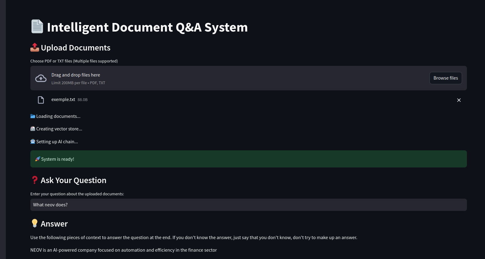

# AI-Powered Document Q&A System

## Overview
This project is an AI-powered document analysis tool that allows users to upload PDF and TXT documents and ask questions. The system uses advanced natural language processing to understand and retrieve relevant answers from the uploaded documents.

## Features
- Multi-document upload support (PDF and TXT)
- AI-powered contextual question answering
- Vector-based document embedding for efficient retrieval
- Web interface using Streamlit
- Source document tracing for transparency

## output exemple 



## Technology Stack
- **Language Model**: Llama-3.2-1B (Hugging Face Hub)
- **Embedding Model**: sentence-transformers/all-MiniLM-L6-v2
- **Vector Database**: ChromaDB
- **Web Framework**: Streamlit

---

## Installation Guide

### Prerequisites
- Python 3.8+
- Hugging Face Account (for API access)

### Setup Instructions
1. Clone the repository:
   ```bash
   git clone https://github.com/yourusername/document-qa-system.git
   cd document-qa-system
   ```
2. Create a virtual environment and activate it:
   ```bash
   python -m venv venv
   source venv/bin/activate  # For Linux/macOS
   venv\Scripts\activate     # For Windows
   ```
3. Install dependencies:
   ```bash
   pip install -r requirements.txt
   ```
4. Set up environment variables:
   - Create a `.env` file in the project root
   - Add your Hugging Face API token:
     ```
     HUGGINGFACE_API_TOKEN=your_token_here
     ```

5. Run the application:
   ```bash
   streamlit run app.py
   ```

---

## Key Functionalities

### 1️⃣ Document Loading
```python
def load_documents(self):
    documents = []
    txt_loader = DirectoryLoader(self.docs_dir, glob="**/*.txt", loader_cls=TextLoader)
    documents.extend(txt_loader.load())
    pdf_loader = DirectoryLoader(self.docs_dir, glob="**/*.pdf", loader_cls=PyPDFLoader)
    documents.extend(pdf_loader.load())
    text_splitter = RecursiveCharacterTextSplitter(chunk_size=1000, chunk_overlap=200)
    return text_splitter.split_documents(documents)
```
- Loads both TXT and PDF files from the specified directory.
- Splits the text into smaller chunks to improve embedding efficiency.

### 2️⃣ Creating a Vector Store
```python
def create_vector_store(self, documents):
    vectorstore = Chroma.from_documents(
        documents=documents,
        embedding=self.embeddings,
        persist_directory="./chroma_db"
    )
    return vectorstore
```
- Converts documents into vector embeddings using Hugging Face models.
- Stores embeddings in a ChromaDB vector database for fast retrieval.

### 3️⃣ AI-Powered Retrieval & Answer Generation
```python
def answer_question(self, qa_chain, question):
    formatted_question = f"""Analyze the context carefully and provide a clear, concise answer:
    
    Context Provided
    Question: {question}
    
    Your Response:"""
    response = qa_chain({"query": formatted_question})
    return {
        "answer": response["result"].strip(),
        "source_documents": [doc.page_content for doc in response["source_documents"]]
    }
```
- Retrieves the most relevant documents using vector similarity search.
- Uses an LLM (Llama-3.2-1B) to generate a natural language answer.
- Returns both the AI-generated response and the source documents.

### 4️⃣ Streamlit User Interface
```python
def main():
    st.set_page_config(page_title="Document Q&A System", layout="wide")
    st.title("📄 Intelligent Document Q&A System")
    
    st.subheader("📄 Upload Documents")
    uploaded_files = st.file_uploader(
        "Choose PDF or TXT files (Multiple files supported)",
        type=["pdf", "txt"],
        accept_multiple_files=True
    )
```
- Provides a simple web UI for uploading documents and asking questions.
- Displays the AI-generated response and allows users to view the source documents.

---

## Example Usage
### Sample Document
**Input Document:**
```
NEOV is an AI-powered company focused on automation and efficiency in the finance sector.
```

### User Query
```
What does NEOV do?
```

### Expected AI Response
```
NEOV is an AI-powered company focused on automation and efficiency in finance.
```

---

## Limitations
- Supports only TXT and PDF formats.
- Requires an active internet connection for Hugging Face API access.
- Model context understanding is limited to ~512 tokens per response.

---

## Future Enhancements
- Expand support for DOCX and HTML files.
- Implement local embedding models for offline use.
- Improve answer explanations with citations.

---

